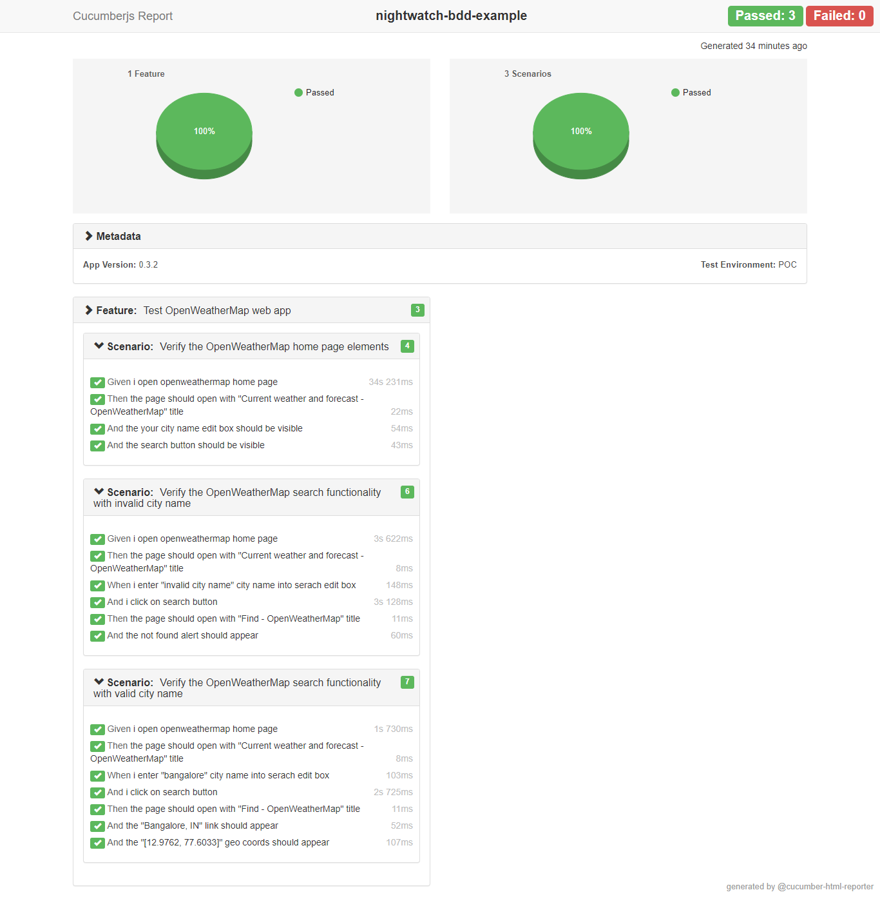

# BDD based WebUI Test Automation using NightwatchJS framework


[](https://www.npmjs.com/package/nightwatch/v/1.0.19)
[](https://www.npmjs.com/package/nightwatch)

[](https://www.linkedin.com/in/jagadeesh-c-2a3a9423)

Nightwatch.js is an automated testing framework for web applications and websites, written in Node.js and using the [W3C WebDriver](https://www.w3.org/TR/webdriver/) API (formerly [Selenium WebDriver](https://github.com/SeleniumHQ/selenium/wiki/JsonWireProtocol)).

It is a complete End-to-End testing solution which aims to simplify writing automated tests and setting up Continuous Integration. Nightwatch can also be used for writing Node.js unit and integration tests.

*The name Nightwatch was inspired by the famous painting The Night Watch by Dutch artist Rembrandt van Rijn. The masterpiece is prominently displayed in the Rijksmuseum, in Amsterdam - The Netherlands.*

## Steps to run
- Clone the [repository](https://github.com/jagadeeshshetty/nightwatch-bdd-example.git).
- Run `$ npm i` command.
- Run `$ npm run test:chrome` command.
- Test execution log is as follows
    ```bash
    $ npm run test:chrome

    > nightwatch-bdd-example@1.0.0 test:chrome F:\nightwatch-bdd-example
    > cross-env NIGHTWATCH_ENV=chrome npm test

    > nightwatch-bdd-example@1.0.0 test F:\nightwatch-bdd-example
    > mkdirp report && cucumber-js --require-module babel-core/register --require cucumber.conf.js --require step-definitions --format node_modules/cucumber-pretty --format json:report/cucumber_report.json

    DevTools listening on ws://127.0.0.1:49887/devtools/browser/9d613e3c-6950-4632-b8bf-5144420bcaa4
    Feature: Test OpenWeatherMap web app

    Scenario: Verify the OpenWeatherMap home page elements
        Given i open openweathermap home page
        Then the page should open with "Сurrent weather and forecast - OpenWeatherMap" title
        √ Testing if the page title equals "Сurrent weather and forecast - OpenWeatherMap"  - 11 ms.
        And the your city name edit box should be visible
        √ Testing if element <input[placeholder="Your city name"]> is visible  - 28 ms.
        And the search button should be visible
        √ Testing if element <//button[@class="btn btn-orange"]> is visible  - 32 ms.

    Scenario: Verify the OpenWeatherMap search functionality with invalid city name
        Given i open openweathermap home page
        Then the page should open with "Сurrent weather and forecast - OpenWeatherMap" title
        √ Testing if the page title equals "Сurrent weather and forecast - OpenWeatherMap"  - 7 ms.
        When i enter "invalid city name" city name into serach edit box
        √ Element <//input[@placeholder='Your city name']> was visible after 30 milliseconds.
        And i click on search button
        Then the page should open with "Find - OpenWeatherMap" title
        √ Testing if the page title equals "Find - OpenWeatherMap"  - 9 ms.
        And the not found alert should appear
        √ Element <//*[@class='alert alert-warning'][contains(text(),'Not found')]> was visible after 25 milliseconds.
        √ Testing if element <//*[@class='alert alert-warning'][contains(text(),'Not found')]> is visible  - 27 ms.

    Scenario: Verify the OpenWeatherMap search functionality with valid city name
        Given i open openweathermap home page
        Then the page should open with "Сurrent weather and forecast - OpenWeatherMap" title
        √ Testing if the page title equals "Сurrent weather and forecast - OpenWeatherMap"  - 8 ms.
        When i enter "bangalore" city name into serach edit box
        √ Element <//input[@placeholder='Your city name']> was visible after 24 milliseconds.
        And i click on search button
        Then the page should open with "Find - OpenWeatherMap" title
        √ Testing if the page title equals "Find - OpenWeatherMap"  - 9 ms.
        And the "Bangalore, IN" link should appear
        √ Element <//a[contains(text(),'Bangalore, IN')]> was visible after 28 milliseconds.
        √ Testing if element <//a[contains(text(),'Bangalore, IN')]> is visible  - 24 ms.
        And the "[12.9762, 77.6033]" geo coords should appear
        √ Element <//a[contains(text(),'[12.9762, 77.6033]')]> was visible after 24 milliseconds.
        √ Testing if element <//a[contains(text(),'[12.9762, 77.6033]')]> is visible  - 22 ms.

    3 scenarios (3 passed)
    17 steps (17 passed)
    0m38.744s
    Cucumber HTML report report/cucumber_report.html generated successfully.
    ```
- Test report and [link](https://github.com/jagadeeshshetty/nightwatch-bdd-example/blob/master/report/cucumber_report.html).

Screenshot:

